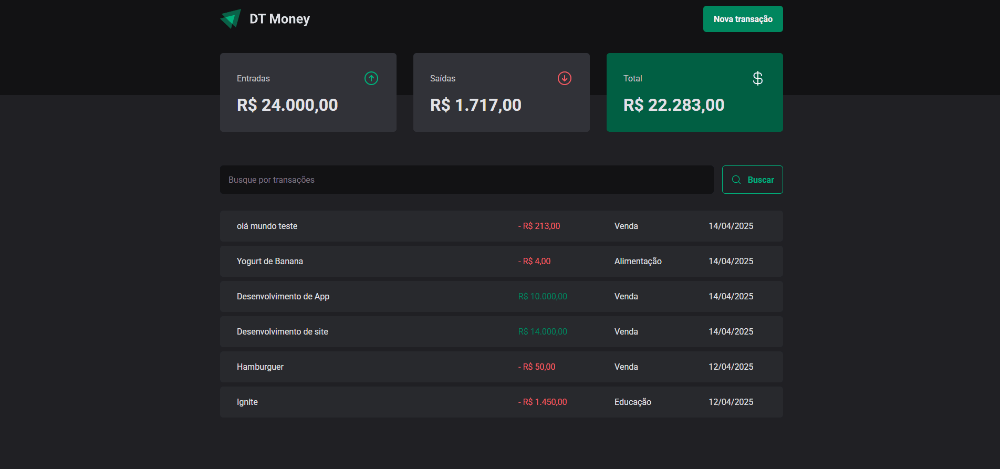

<p align="center">
  
</p>

# 💰 dtmoney

Aplicação de controle financeiro, desenvolvida durante o bootcamp **Ignite** da [Rocketseat](https://www.rocketseat.com.br/), com o objetivo de cadastrar e listar transações financeiras.

## 🧪 Tecnologias

Este projeto foi desenvolvido com as seguintes tecnologias:

- [React](https://reactjs.org/)
- [TypeScript](https://www.typescriptlang.org/)
- [Vite](https://vitejs.dev/)
- [Styled Components](https://styled-components.com/)
- [Axios](https://axios-http.com/)
- [React Hook Form](https://react-hook-form.com/)
- [Zod](https://zod.dev/)
- [JSON Server](https://github.com/typicode/json-server)

## 🚀 Como executar

Clone o projeto e acesse a pasta:

```bash
git clone https://github.com//EnzoXavier1001/dt-money.git
cd dt-money
```

Instale as dependências:

```bash
npm install
# ou
yarn
# ou
pnpm install
```

Inicie a fake API com o JSON Server:

```bash
npm run server
# ou
yarn server
# ou
pnpm server
```

Depois, inicie a aplicação:

```bash
npm run dev
# ou
yarn dev
# ou
pnpm dev
```

A aplicação estará disponível em: `http://localhost:5173`  
A API estará rodando em: `http://localhost:3000`

## 💡 Funcionalidades

- Cadastro de transações (entrada e saída)
- Listagem de transações
- Cálculo automático do saldo
- Integração com JSON Server para simular API

## 📸 Imagens

Aqui está um gif mostrando a aplicação em funcionamento:

<p align="center">
  
</p>

## 📦 Scripts disponíveis

```bash
# Iniciar o projeto
pnpm run dev

# Rodar o JSON Server com os dados simulados
pnpm run backend
```
